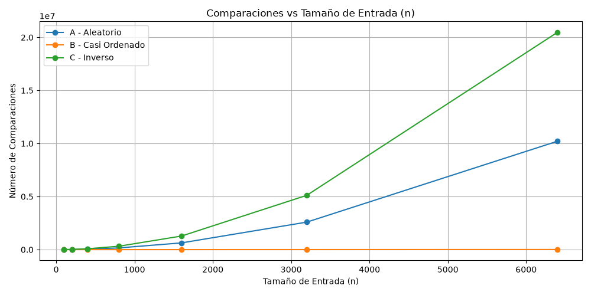
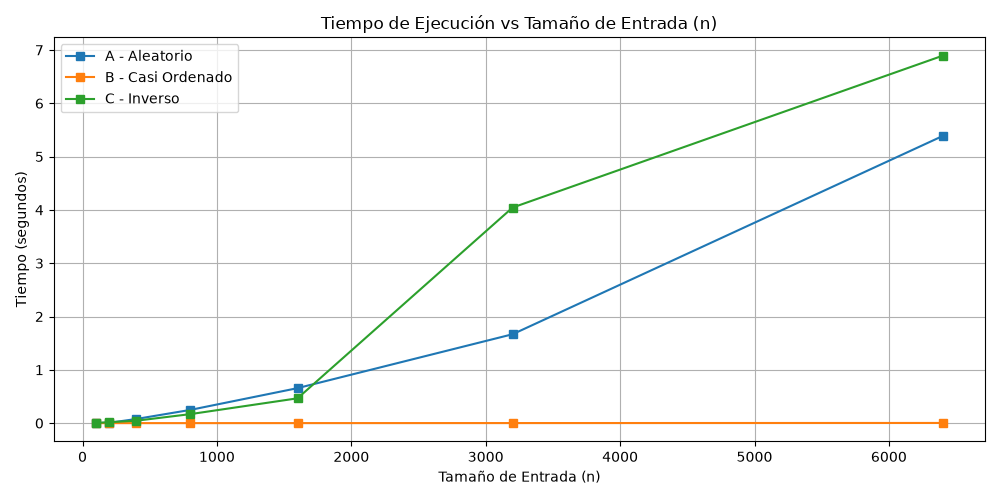
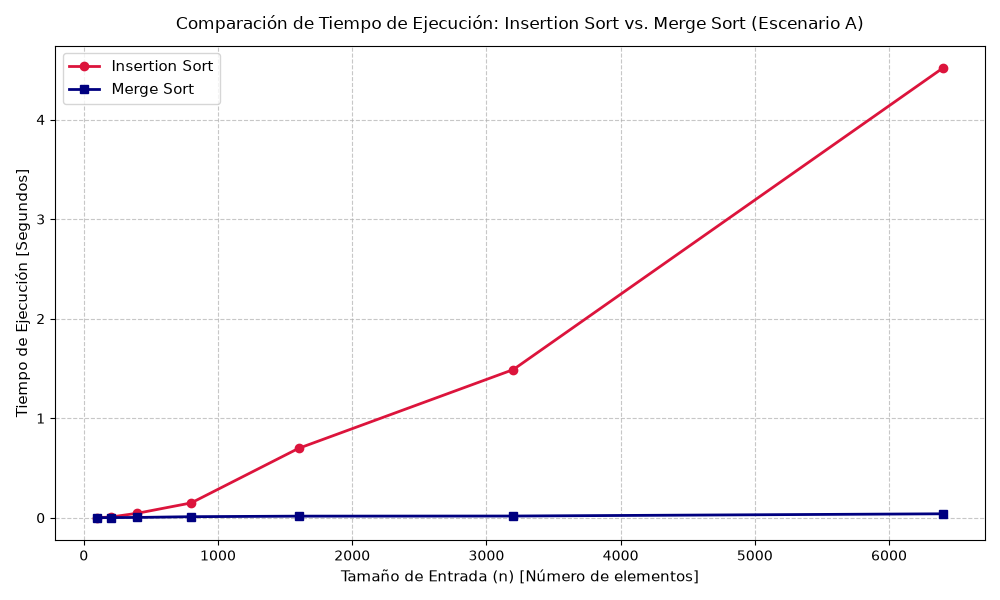

# LABORATORIO 01 - FUNDAMENTOS, COMPLEJIDAD Y RECURRENCIAS

Nombre Estudiante: Sara Regino Ferraro

## Instrucciones para reproducir el experimento

### 1. Clonar el repositorio y acceder a la carpeta

```bash
git clone <https://github.com/ArsaOniSaturn/sara-regino-analisis-de-algoritmos.git>
cd lab1-fundamentos-complejidad-recurrencias
```

### 2. Creación e instalación del entorno virtual
En Windows:

```
# Crear entorno virtual
python -m venv venv

# Activar entorno virtual
.\venv\Scripts\activate

# Instalar dependencias desde el archivo de requirements.txt
pip install -r requirements.txt
```

En Linux / macOS:

```
# Crear entorno virtual
python3 -m venv venv

# Activar entorno virtual
source venv/bin/activate

# Instalar dependencias desde el archivo de requirements.txt
pip install -r requirements.txt
```

### 3. Ejecución de los Experimentos
Asegúrese de tener activo el entorno virtual antes de ejecutar cualquiera de los módulos.

#### Parte 1: Experimento de Escenarios con Insertion Sort
Ejecuta la evaluación de los tres escenarios (Aleatorio, Casi Ordenado e Inverso), imprime las métricas en consola y genera las gráficas individuales de comparaciones y tiempos:

[[parte3_casos.py](parte3_casos.py)]

#### Parte 2: Comparación entre Insertion Sort y Merge Sort
Ejecuta la simulación sobre el Escenario A para ambos algoritmos y genera la gráfica comparativa unificada (graficas/parte4_tiempo.png):

[[parte4_complejidad.py](parte4_complejidad.py)]


## Situación Problema a Resolver

**Plataforma Tamiza — Secretaría de Salud departamental.**

La Secretaría de Salud opera un programa de tamizaje cardiovascular en 340 laboratorios e IPS del departamento. Cada laboratorio envía durante el día los resultados de las pruebas que procesó. Al cierre de la jornada, la plataforma Tamiza tiene acumulados 1.200.000 registros pendientes de gestión: los resultados de los últimos treinta días que todavía no han sido contactados.

Cada registro trae un índice de riesgo entre 0 y 1000, calculado por la plataforma a partir de los valores de laboratorio y de la historia clínica del paciente. Entre las 2:00 a. m. y las 6:00 a. m. corre un proceso automático que debe ordenar los 1.200.000 registros por índice de riesgo, de mayor a menor, y generar la lista de llamadas del día. A las 6:00 a. m. el centro de contacto abre y empieza a llamar por esa lista, de arriba hacia abajo: los pacientes con mayor riesgo son contactados primero para citarlos a valoración médica. La ventana del proceso es, por lo tanto, de cuatro horas y no es negociable.

**El problema.** La plataforma fue escrita hace ocho años, cuando el programa cubría 4 municipios y unos 20.000 registros. El ordenamiento se implementó entonces con insertion sort y nunca se volvió a tocar: siempre funcionó. Con la ampliación del programa a todo el departamento, el proceso empezó a desbordar la ventana. En las últimas semanas, la lista de llamadas ha quedado incompleta tres veces: el proceso no alcanzó a terminar antes de las 6:00 a. m. y el centro de contacto trabajó con una lista parcial, no ordenada por riesgo.

**La decisión sobre la mesa.** El área de infraestructura propone duplicar la capacidad del servidor —contratar una máquina del doble de velocidad de reloj— y dejar el software como está. El argumento es que el algoritmo "ya está probado, lleva ocho años funcionando y entrega el resultado correcto". La Secretaría le pide a usted un concepto técnico antes de firmar el contrato.

**Cómo llega el lote de registros.** El equipo de la plataforma le informa que la forma en que llegan los datos depende del canal de origen, y que hay tres escenarios posibles:

| Escenario | Canal de Origen | Cómo llega el lote de registros
| :--- | :--- | :---
| A - Aleatorio | Cargue directo desde el portal web de los laboratorios | Los registros quedan en el  orden en que cada laboratorio los subió: sin ninguna relación con el índice de riesgo.
| B - Casi Ordenado | Reproceso sobre la lista del día anterior | El 98 % del lote es la lista de ayer, que ya quedó ordenada por riesgo; el 2 % restante son los resultados nuevos del día, que se anexan al final sin ordenar.
| C - Orden inverso | Migración desde el sistema legado de historia clínica | El sistema anterior exporta los registros del índice de riesgo menor al mayor, es decir, exactamente al revés de lo que Tamiza necesita.


### PARTE 1 - Analizar el algoritmo antes de comprar hardware:

**Pregunta:**

"La Secretaría está por firmar la compra de un servidor del doble de velocidad para que el proceso de Tamiza quepa en la ventana de cuatro horas. ¿Por qué debe analizarse primero el algoritmo, si el que está en producción lleva ocho años entregando el resultado correcto?"

**Respuesta:** 

Aunque es verdad que el algorítmo anterior funcionaba, éste estaba diseñado para procesar una cierta cantidad de datos que, en ese entonces, era bastante menor. Se hablaba de 20.000 registros en una zona relativamente más pequeña. Sin embargo, a medida que la Secretaría de Salud fue expandiendo su campo de aplicación con su programa Tamiza, éste a su vez requería una mejora que estuviese a la altura de la información que recibía. O sea, la capacidad de ordenar los datos que llegan en el tiempo que se requiere. 

El orden en el que el sistema recibe la información y cómo está diseñado el algoritmo para afrontar esa carga, influyen de manera significativa en el resultado que se espera en el tiempo estipulado. Entonces, a pesar de que la solución que parece más obvia sea la de invertir en un servidor más rápido, no sería una decisión sabia si, al analizar el cómo funciona el flujo del algoritmo, se ve que este puede ser mejorado a las necesidades que se tienen en la actualidad con los mismos recursos.


### PARTE 2 — Responsabilidad ambiental y ética de la implementación

**Pregunta:**

"Como responsable técnico de Tamiza, ¿qué responsabilidad ambiental y ética asume al decidir qué algoritmo de ordenamiento se ejecuta cada madrugada sobre los datos de 1.200.000 pacientes?"

**Respuesta:** 

El simple hecho de que un programa se ejecute, independientemente del tiempo en que se demoró en terminar, se traduce en consumo energético. Y si a eso le sumamos que éste corre durante 4 horas seguidas durante años, a largo plazo se convierte en factores críticos de costos (para la empresa) y un incumplimiento a la sostenibilidad para con el medio ambiente.

Además, es de suma importancia que un algoritmo funcione rápida y correctamente. En especial uno que se dedica a ordenar las listas de llamadas a pacientes con resultados graves que necesitan que el proceso avance. Y si este falla, podría decirse que activaría un efecto dominó: el operador de llamadas, con la lista incompleta, llamaría a la persona con menos riesgo y se saltaría al más urgente; esto resultaría en que el paciente que sí necesitaba con urgencia los resultados, lo dejen de lado y afecte a su salud de manera irreversible o crítica. A su vez, también perjudicaría la reputación de la Secretaría de Salud y su confiabilidad en entregar un servicio óptimo a la gente. Es una situación en donde todo el mundo queda manchado por la falta de revisión y mantenimiento del algoritmo que el equipo de desarrollo debió haber previsto/solucionado de manera inmediata antes de siquiera haber alcanzado al cliente.


### PARTE 3 — Peor caso, mejor caso y caso promedio, demostrados en Python

#### 3.1 — Explicación

El mejor de los casos es aquel donde solo se necesita de una comparación para ordenar los datos. O sea, el algoritmo toma la menor cantidad de tiempo o recursos, aquí la información ya entra ordenada. El peor de los casos es cuando el algoritmo debe revisar todos los elementos, toma mayor cantidad de recursos y más tiempo. En cuanto al caso promedio, se podría decir que es el más común, el comportamiento habitual que se espera de un algoritmo al recibir entradas aleatorias. 

Para decidir si el algoritmo de Tamiza entra en producción, lo ideal sería usar el mejor de los casos. Como se había mencionado antes, en el mejor de los casos su entrada ya estaría ordenada por lo que no se necesitaría de mucho tiempo para tener las listas de llamadas completada. Sin embargo, en el mundo real no todo es perfecto. Así que, realistamente, el caso más adecuado sería el caso promedio. En donde se tendría la mitad de comparaciones y desplazamientos para ordenar el arreglo, en especial con una ventana tan estricta de 4 horas. 

Predicción de Tamiza para Insertion Sort:
- El escenario A es el caso promedio.
- El escenario B es el mejor caso.
- El escenario C es el peor caso.

#### 3.2 — Demostración experimental

**GRÁFICA PARTE3_COMPARACIONES**


**GRÁFICA PARTE3_TIEMPO**


Después de haber hecho experimentos [[encuéntrese en: parte3_casos.py](parte3_casos.py)] con datos generados aleatoriamente, casi ordenados e inversos [[encuéntrese en: datos.py](datos.py)] con Insertion Sort [[encuéntrese en: algoritmos.py](algoritmos.py)] y, como se había predicho y observando las gráficas, el escenario A es el caso promedio, el escenario B es el mejor caso y el escenario C es el peor caso.


### PARTE 4 — Complejidad de merge sort e insertion sort: cálculo y validación

#### 4.1 — Cálculo teórico

**RECURRENCIA DE MERGE SORT**

La ecuación de recurrencia para Merge Sort se define como:

$T(n) = 2T(n/2) + \Theta(n)$

- **2:** Representa el número de subproblemas/llamadas recursivas, puesto que el algoritmo divide el arreglo original en dos mitades (izquierda y derecha)
- **$T(n/2)$**: Representa el tamaño del subproblema. Cada uno de los subproblemas opera sobre una entrada de tamaño $(n/2)$
- **$\Theta(n)$**: Es el trabajo o costo de dividir y combinar los arreglos.

Así pues, lo resolvemos con el *Método Maestro*:

$T(n) = aT(n/b) + f(n)$

donde,

- **a**: 2 (número de subproblemas)
- **b**: 2 (valor que reduce el tamaño a la mitad)
- **f(n)**: Es el costo de combinación o $\Theta(n)$

**1.** Calculamos la función límite $n^{log_b}a$:

$$n^{\log_b a} = n^{\log_2 2} = n^1 = n$$

**2.** Comparamos $f(n) = \Theta(n)$ con $n^{\log_b a} = n$:

$$f(n) = \Theta\left(n^{\log_b a}\right) \implies \Theta(n) = \Theta(n)$$

Dado que $f(n)$ crece exactamente a la misma tasa asintótica que $n^{\log_b a}$, aplica el Caso 2 del Método Maestro.

De acuerdo a la mencionado anteriormente, la solución es:

$$T(n) = \Theta\left(n^{\log_b a} \cdot \log_2 n\right) = \Theta(n \log_2 n)$$


**COTA DE INSERTION SORT**

Ahora, vamos a calcular la cota de Insertion Sort línea a línea sobre el peor caso (lista ordenada de forma inversa), partiendo de la función *Insertion_Sort()* [[vease en: algoritmos.py](algoritmos.py)].

Sea $c_k$ el costo constante de ejecutar la línea $k$, $n$ el tamaño del arreglo y $ti$ la cantidad de veces que se ejecuta una línea dentro del *while* para un valor $i$:

```
def insertion_sort(datos: list[int]) -> tuple[list[int], int]:

    datos_copia = datos.copy()                     # Línea 1 - Costo: c1 - Veces: 1
    comparaciones = 0                              # Línea 2 - Costo: c2 - Veces: 1
    n = len(datos_copia)                           # Línea 3 - Costo: c3 - Veces: 1

    for i in range(1, n):                          # Línea 4 - Costo: c4 - Veces: n
        clave = datos_copia[i]                     # Línea 5 - Costo: c5 - Veces: n - 1
        j = i - 1                                  # Línea 6 - Costo: c6 - Veces: n - 1

        while j >= 0:                              # Línea 7 - Costo: c7 - Veces: sum(ti + 1)
            comparaciones += 1                     # Línea 8 - Costo: c8 - Veces: sum(ti)
            if datos_copia[j] <= clave:            # Línea 9 - Costo: c9 - Veces: sum(ti)
                break                              # Línea 10 - Costo: c10 - Veces: 0
            datos_copia [j + 1] = datos_copia[j]   # Línea 11 - Costo: c11 - Veces: sum(ti)
            j -= 1                                 # Línea 12 - Costo: c12 - Veces: sum(ti)
        datos_copia[j + 1] = clave                 # Línea 13 - Costo: c13 - Veces: n - 1

    return datos_copia, comparaciones              # Línea 14 - Costo: c14 - Veces: 1
```
Quedaría entonces:

$$T(n) = (C1 + C2 + C3 + C14) + C4n + C5(n-1) + C6(n-1) + C7\sum_{i=1}^{n-1}(ti + 1) + C8\sum_{i=1}^{n-1}(ti) + C9\sum_{i=1}^{n-1}(ti) + C11\sum_{i=1}^{n-1}(ti) + C12\sum_{i=1}^{n-1}(ti) + C13(n-1) $$

Organizando términos semejantes y recordando que:

$\sum_{i=1}^{n-1} i = \frac{n(n-1)}{2} = \frac{n^2 - n}{2}$ y $\sum_{i=1}^{n-1} (i + 1) = \frac{n^2 + n - 2}{2}$

Quedaría:

$$T(n) = (C1 + C2 + C3 + C14) + C4n + (C5 + C6 + C13)(n-1) + C7\left(\frac{n^2+n-2}{2}\right) + (C8 + C9 + C11 + C12)\left(\frac{n^2+n}{2}\right)$$

Agrupando los términos por grados de $n$:

$$T(n) = A n^2 + B n + C$$

Donde $A = (\frac{C7 + C8 + C9 + C11 + C12}{2})$ (una constante positiva). 

Por tanto, descartando los términos de orden inferior y las constantes multiplicativas, la cota superior del peor caso es $\Theta(n^2)$.

**TABLA DE COMPLEJIDAD**

| Algoritmo | Mejor Caso | Caso Promedio | Peor Caso |
| :--- | :--- | :--- | :--- |
| Insertion Sort | $\Omega(n)$ | $\Theta(n^2)$ | $\mathcal{O}(n^2)$ |
| Merge Sort | $\Omega(n \log_2 n)$ | $\Theta(n \log_2 n)$ | $\mathcal{O}(n \log_2 n)$ |
 
#### 4.2 — Validación experimental

**GRÁFICA PARTE4_TIEMPO**


Luego de realizar los respectivos experimentos [[encuéntrese en: parte4_complejidad.py](parte4_complejidad.py)] con datos aleatorios (Escenario A), tanto para Insertion Sort como para Merge Sort [[encuéntrese en: algoritmos.py](algoritmos.py)], la gráfica respalda que la mejor decisión para Tamiza es usar Merge Sort. 

Con Insertion Sort, a medida que la cantidad de datos aumentaba, comparaba un elemento y lo insertaba, el tiempo que tomaba para ejecutar dichas comparaciones también aumentaba.
En cambio con Merge Sort, con su paradigma de divide y vencerás, dividió el arreglo a la mitad para al final combinarlos, comparando sus elementos para unirlos en un nuevo orden completamente estructurado. Así tomó menos tiempo realizando la operación, algo crítico para la ventana de 4 horas que se pedía.


#### 4.3 — Concepto técnico a la Secretaría de Salud

**Pregunta:**

"Cierre el informe con una sección de entre 400 y 600 palabras dirigida al equipo de ingeniería de la Secretaría, respondiendo la consulta con la que abre la situación problema."

**Respuesta:**

Se recomienda la implementación de Merge Sort como el estándar único para el sistema Tamiza.

Con la arquitectura actual, el canal de entrada se ve sujeto a variaciones impredecibles entre datos totalmente aleatorios (Escenario A), datos con alto porcentaje de ordenamiento previo (Escenario B) y datos en orden inverso (Escenario C). Mantener tres implementaciones distintas incrementa el costo de mantenimiento.

Aunque Insertion Sort presenta un desempeño ideal cuando los datos están casi ordenados (Escenario B) [registrando tiempos cercanos a cero segundos para n = 6.400], se satura ante variaciones. Para n = 6.400, mientras Insertion Sort requiere 20.476.800 comparaciones en el peor caso (Escenario C) y 10.243.200 en el caso promedio (Escenario A), Merge Sort mantiene una cota superior de solo 78.000 (aproximadamente) comparaciones en los tres escenarios. 


Con base en las mediciones experimentales para el tamaño máximo evaluado de n = 6.400

 - Insertion Sort (Escenario A): Registró 10.243.200 comparaciones. Al extender la complejidad promedio O(n^2) a n = 1.200.000, el tiempo estimado asciende a 360.000 segundos.
 - Merge Sort (Escenario A): Su comportamiento responde a O(nlog2n). Con n = 1.200.000, la cantidad estimada de comparaciones es de 1.200.000 x log2(1.200.000) aproximadamente 24,2x10^6 comparaciones. El tiempo estimado de ejecución es de aprox 1,61 segundos.
 
El proceso bajo Insertion Sort NO cabe en la ventana de 4 horas. Por el contrario, Merge Sort procesa sin problema el volumen de 1.200.000 registros, ejecutándose en un tiempo muy inferior al límite.


De acuerdo con nuestras mediciones consolidadas en la gráfica parte3_comparaciones.png, al duplicar el tamaño de la entrada en Insertion Sort de n = 3.200 a n = 6.400 en el Escenario C, el número de comparaciones pasa de 5.118.400 a 20.476.800; es decir, el trabajo se cuadruplica por cada duplicación en el volumen de datos.

Duplicar la potencia del hardware solo reduciría el tiempo de ejecución a la mitad, lo que resulta insignificante frente al crecimiento cuadrático del volumen de datos. El cuello de botella es estrictamente algorítmico, no de infraestructura. La optimización del software mediante Merge Sort resuelve el problema sin incurrir en gastos de hardware.